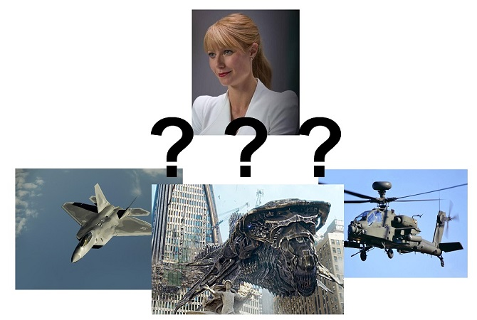

```{r setup, include=FALSE}
# cache results
knitr::opts_chunk$set(echo = FALSE, eval = TRUE, message=FALSE, warning = FALSE, fig.align='center')
```

# Inspirations


## Dragon Ball Power Levels


## The ELO Alghorithm

$$
\begin{array}{lll}
r_{i} & \leftarrow & r_i + \kappa (s_{i,j} - \mu_{i,j}) 
\\
r_j & \leftarrow & r_j + \kappa (s_{j,i} - \mu_{j,i})
\end{array}
$$


---

# Building my Dataframe
## My sample

### Movies
```{r}
# library to read the excell file
library(readxl)

# library to make the dataset acceptable
library(tidyr)

# library to have tibbles and manipulate thes easier
library(dplyr)

# library to manipulate strings, in particular I need it 
# for regular expressions 
library(stringr)

# library for graphs
library(ggplot2)

# library for some correlation analysis
library(modelr)

# library to print df in a cool way
library(knitr)

# set print option
knit_print.data.frame <- kable
# read all the sheets
# https://stackoverflow.com/a/12945838
read_excel_allsheets <- function(filename, tibble = TRUE) {
  
    sheets <- excel_sheets(filename)
    
    x <- lapply(sheets, function(X) read_excel(filename, sheet = X))
    
    if(!tibble) x <- lapply(x, as.data.frame)
    
    names(x) <- sheets
    
    return(x)
}

# read excell dataset
# (now I have a list of tibbles)
raw_avengers_list_of_tibble <- read_excel_allsheets("Avengers.xlsx")

names(raw_avengers_list_of_tibble) %>% kable(col.names = c("My movies:"))
```


---

### Dataset Structure
```{r}
# turn the list of tibble in one single tibble
raw_avengers_tibble <- 
  bind_rows(raw_avengers_list_of_tibble, .id="movie") %>%
  # add ordered  id's
  mutate(id = row_number()) %>%
  select(id, everything())

head(raw_avengers_tibble, n=10) %>% kable()
```

---

## The concept of fight

### Variants

```{r}
# (select only id winner and loser to print some clear samples)
rat_s <- raw_avengers_tibble %>% select(id, winner, loser)
```


I have different variants of fights:

* 1 vs 1
```{r}
rat_s %>% filter(id==13) %>% kable()
```

* 1 vs many
```{r}
rat_s %>% filter(id==49) %>% kable()
```

---

### More Variants

* many vs 1 (or many vs many) 
```{r}
rat_s %>% filter(id==34 | id==30) %>% kable()
```

* more than one winner
```{r}
rat_s %>% filter(id==23) %>% kable()
```

---

### More Variants (2)

* partial damange
```{r}
rat_s %>% filter(id==93) %>% kable()
```

---

# Data Manipulations

<!--
## Tools

Libraries:
```{r}
library(readxl) # lib to read the excell file
library(tidyr)  # lib to make to extract the (intentionally) dirty dataset
library(dplyr)  # library to have tibbles and manipulate thes easier

library(stringr)  # library to manipulate strings, in particular I need it 
                  # for some regular expressions 

library(ggplot2)  # library for graphs
```
-->

## Data Tiding
### Operations

* Separate rows with "charater 1,charater 2,..." into more partial victories (w 1/n "winning rate")
* Turn values with singular charaters into "1-charater" 
* separate pairs "n-charaters" in 2 columns

---

### Results
```{r}

# split rows were winner is a list of charater
raw_avengers_tibble_2 <- raw_avengers_tibble %>%
  mutate(
    divide_loser_n_by = str_count(winner, ",")+1,
  ) %>% 
  separate_rows(winner, sep=",")

# replace "charater" with "1-charater" in df$winner and df$looser
raw_avengers_tibble_3 <- raw_avengers_tibble_2 %>%
  
  # mutate in winner
  mutate(
    winner = ifelse(
      str_detect(winner, "-"), 
      winner, 
      paste("1", winner, sep="-")
      )
  ) %>%
  
  # mutate in loser
  mutate(
    loser = ifelse(
      str_detect(loser, "-"), 
      loser, 
      paste("1", loser, sep="-")
      )
  )


# separate pairs "number-charater name" in 2 columns 
# (in df$winner and df$looser)
fights_tidy <- raw_avengers_tibble_3 %>%
  
  # separate winner
  separate(winner, into=c("winner_n", "winner_charater"), sep="-") %>%
  # separate loser
  separate(loser, into=c("loser_n", "loser_charater"), sep="-") %>%
  
  # convert cols winner_n and loser_n in numbers
  mutate(
    winner_n = as.double(winner_n), 
    loser_n = as.double(loser_n)/divide_loser_n_by
    ) %>% 
  
  # order columns
  select(id, winner_n, winner_charater, loser_n, loser_charater, movie, comment, terrain_winner, terrain_loser)

fights_tidy %>% select(id, winner_n, winner_charater, loser_n, loser_charater) %>% kable()

```

---

## Charater list + general statistics

```{r}

# Charater list  ----
all_charaters <- 
  
  # all winners
  fights_tidy %>%
  select(winner_charater) %>% 
  rename(charater=winner_charater) %>%
  
  bind_rows(
    # all losers
    fights_tidy %>%
      select(loser_charater) %>% 
      rename(charater=loser_charater) 
  ) %>%
  distinct() %>%
  mutate(id=row_number()) %>%
  select(id, everything())

# save the dataset
write.csv(all_charaters, "charaters.csv")

# statistics for each charater ----

# add wins statistics foreach charater
all_charaters_statistics <- fights_tidy %>% 
  group_by(winner_charater) %>%
  summarise(
    n_win = n(), 
  ) %>%
  rename(charater=winner_charater) %>%
  
  # add loss statistics foreach charater
  full_join(
    
    fights_tidy %>% 
      group_by(loser_charater) %>%
      summarise(
        n_lose = n()
      ) %>%
      rename(charater=loser_charater), 
    
    by= "charater"
  ) %>% 
  
  # replace NA values with 0
  replace_na(list(n_win=0, n_lose=0)) %>%
  
  # calculate total fights
  mutate(n_fights = n_win + n_lose) %>%
  
  # arrange by fights number
  arrange(-n_fights) %>%

  # add charater type label
  left_join(all_charaters, by="charater") %>%

  # order columns
  select(id, charater,n_fights, n_win, n_lose)

all_charaters_statistics %>% kable()


```

---

## Prepare the dataframe for ELO

### Expected Format
```{r}
expected <- tibble(
  White = c(15, 22, 140), 
  Black = c(44, 16, 90), 
  Score = c(1, 0, 0.5)
)

expected %>% kable()
```

---

### Actual Dataset Format
```{r}
head(fights_tidy %>% select(winner_n, winner_charater, loser_n, loser_charater), n=5) %>% kable()
```

---

### My Choices
I decided to apply this algorithm:

* Winner goes always in White, Loser goes always in Black => score will be always be a numbers in (0,1]
* given n winners and m losers, I will have...
  + m/n lines where White=winner, Black=loser, Score=1
  + (eventually) one line with White=winner, Black=loser and  $$Score=\frac{rest(\frac{m}{n})}{n} * 0.5 + 0.5$$
* (Instead of charater names, I should use IDs)
  
---

### Dataset in ELO Format
```{r}

# remove fights where the number of winners/losers is unknow
fights_tidy_clear <- fights_tidy %>% 
  filter(!is.na(winner_n) & !is.na(loser_n))

# calculate the number of "integer" rows + extra foreach fight
fights_tidy_clear <- fights_tidy_clear %>% 
  mutate(
    number_integer_rows = loser_n %/% winner_n, 
    extra = (loser_n %% winner_n) / winner_n
  )


fights_elo_format_readable <- 
  
  # fights with integer score
  fights_tidy_clear %>% 
  filter(number_integer_rows > 0) %>%
  group_by(id) %>%
  expand(count = seq(1:number_integer_rows), winner=winner_charater, loser=loser_charater, score=1, 
         movie=movie, comment=comment) %>%
  
  bind_rows(
    
    # fights with decimal scores
    fights_tidy_clear %>% 
      filter(extra>0) %>%
      rename(
        winner = winner_charater, 
        loser = loser_charater, 
        score = extra, 
      ) %>% 
      mutate(count = number_integer_rows + 1) %>%
      select(id, count, winner, loser, score, movie, comment)
  ) %>%
  
  # order by id
  arrange(id, count)


# make the score from (0,1] -> (0.5,1]
# (they are all victories)
fights_elo_format_readable <- fights_elo_format_readable %>% 
  mutate(
    score=0.5 + score/2
  )

# insert charater ids
fights_elo_format_readable <- fights_elo_format_readable %>%
  
  # set the id of winner
  left_join(
    all_charaters %>% rename(winner_id = id), 
    by=c("winner"="charater")
  ) %>%
  
  # # set the id of winner
  left_join(
    all_charaters %>% rename(loser_id = id), 
    by=c("loser"="charater")
  )
  
fights_elo_format <- fights_elo_format_readable %>%
  # set correct var names
  rename(White=winner_id, Black=loser_id, Score=score)

# save the dataset (for shiny app)
write.csv(fights_elo_format, "fights_elo_format.csv")

fights_elo_format %>% select(White, winner, Black, loser, Score) %>%  kable()
    
```

---

# ELO Classification

```{r}

##  Elo rating system
# INPUT
# games: a game *matrix* with columns White, Black and Score
#        Players are integer numbers starting at 1
#        The matrix is sorted in chronological order
# zeta: logistic parameter
# k: update factor
# OUTPUT
# r: rating vector
elo = function(games, z = 400, k = 25) {
  
  # number of players 
  # (players are integer numbers starting at 1)
  n = max(c(games[, "White"], games[, "Black"]))

  # number of games
  m = nrow(games)
  
  # rating vector
  r = rep(0, n)
  
  # iterate through games
  for (i in 1:m) {
    score = games[i, "Score"]
    white = games[i, "White"]
    black = games[i, "Black"]

    # compute update
    spread = r[white] - r[black]
    mu = 1 / (1 + 10^(-spread / z))
    update = k * (score - mu)
    
    # update ratings
    r[white] = r[white] + update
    r[black] = r[black] - update
    
  }
  return(r)
}


```

---

## Results and comments

### And the winner is ...

---- 

### ... Iron Man!


----

### Top 10 Charaters

```{r}

scores_list <- elo(as.data.frame(fights_elo_format))

scores <- 
  tibble(score = scores_list) %>%
  mutate(id = row_number()) %>%
  select(id,everything()) %>%
  left_join(all_charaters, by="id") %>%
  arrange(-score) %>%
  select(id, charater, score)


ggplot(data=scores %>% head(n=10), mapping = aes(x=reorder(charater, -score), y=score, fill=charater)) +
  geom_bar(stat="identity") + 
  theme(axis.text.x = element_text(angle = 90, vjust = 0.5, hjust=1)) +
  ylab("ELO Score") + xlab("Charater")

```

---

### All Data
```{r}
head(scores,n=5) %>% kable()
```

---



---

### Problems

* Inappropriate algorith/data manipulation methods
* "Cinematic Distorsion" (some charaters are too much "in the spotlight")

---

### Problems (2)

* "Implicit Strenghts" (ex. Giant Chitauri, Military veicles, ecc...)

```{r}
scores %>% filter(str_detect(charater, regex("(Chitauri Giant)|(Pepper Potts)|(Fighter)|(Elicopter)"))) %>% kable()
```


---

## Correlation Score-Fights

Now I try to find a correlation between score and fights results
```{r}

cor_score_fights <- scores %>%
  left_join(all_charaters_statistics, by=c("id"))


# ggplot(data=cor_score_fights) +
#  geom_point(mapping=aes(x=n_fights, y=score, color="grey")) +
#  geom_point(mapping=aes(x=n_win, y=score, color="green")) +
#  geom_point(mapping=aes(x=n_lose, y=score, color="red"))

cor_score_fights %>%
  summarise(
    cor_score_tot=cor(score, n_fights), 
    cor_score_win=cor(score, n_win),
    cor_score_lose=cor(score,n_lose)
  ) %>% kable()

```

---

## Correlation Score-Screen Time
### Screen Times
```{r}

screen_times <- read_excel("screen_times.xlsx")

cor_score_screen_time <- scores %>%
  inner_join(screen_times, by="charater") %>% # inner to ignore all unmatched cols
  select(id, charater, score, screen_time) %>% 
  arrange(-screen_time)

head(cor_score_screen_time,n=5) %>% kable()
```

```{r}
cor(cor_score_screen_time$screen_time, cor_score_screen_time$score)
```

---

### Plot + Linear model
```{r}
# linear model
mod <- lm(score~screen_time, data=cor_score_screen_time)
cor_score_screen_time <- cor_score_screen_time %>% add_predictions(mod)

ggplot(data=cor_score_screen_time, mapping=aes(x=screen_time, y=score)) +
  geom_line(aes(y = pred)) +
  geom_point() +
  ggrepel::geom_label_repel(aes(label = charater,
                  box.padding   = 0.35, 
                  point.padding = 0.5,
                  segment.color = 'grey50')) + 
  xlab("Screen Time [seconds]") + ylab("ELO Score")


# source ggrepel code: https://stackoverflow.com/a/48762376/7695333


```

(source screen times: https://www.youtube.com/watch?v=XE0HwXz43WQ)

---

# Shiny App

TODO: LINK


